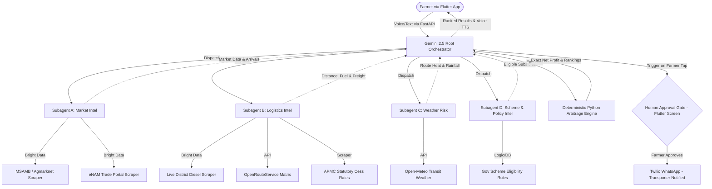

# KisanArbitrage: Agent Architecture & Orchestration

KisanArbitrage leverages **Google Gemini 2.5 Flash** to coordinate a swarm of autonomous subagents that gather, synthesize, and act on multi-source data to provide actionable agricultural intelligence for Indian farmers.

---

## Agent Swarm Architecture

The system uses a hierarchical agent architecture with a Root Orchestrator dispatching specialized subagents in parallel to gather real-time market, logistics, climate, and policy data.



---

## Key Architectural Clarifications

### 1. Farmer Interface: Flutter App (Mobile & Web)
The farmer interacts exclusively via the Flutter application.
- **Farmer → Agent:** Flutter captures voice/text → FastAPI processes ASR & entity extraction → Gemini 2.5 Root Agent.
- **Agent → Farmer:** Real-time SSE stream forwards subagent status updates (`subagent.tool_call`, `subagent.completed`) → Flutter displays animated timeline → Screen 4 renders hero cards + plays Bhashini TTS.
- **After Approval:** When farmer approves on Screen 6 → FastAPI triggers Twilio WhatsApp alert to the **transporter** with pickup details.

### 2. Communication Layers
| From | To | Protocol | Purpose |
|------|-----|----------|--------|
| Flutter | FastAPI | HTTPS + SSE | Voice submission, real-time event streaming, approval triggers |
| FastAPI | Gemini 2.5 SDK | HTTPS SDK | Multi-agent reasoning, intent parsing, structured output |
| FastAPI | Bright Data | HTTPS Proxy | Real-time extraction from MSAMB, eNAM, and fuel portals |
| FastAPI | Open-Meteo | HTTPS REST | Hourly transit weather (temperature, precipitation, humidity) |
| FastAPI | OpenRouteService | HTTPS REST | Road distance and driving duration matrix |
| FastAPI | Twilio | HTTPS REST | WhatsApp notification to transporter after human approval |
| FastAPI | SQLite / Supabase | SQL / REST | Pre-seeded APMC master database and community ground truth |

---

## Subagents (Parallel Execution)

### Subagent A: Market Intel
Responsible for fetching real-time auction prices, arrival volumes, and historical trends across candidate mandis.
- **Tools Used:** MSAMB Scraper (Bright Data), eNAM Scraper (Bright Data), Agmarknet historical table.
- **Output:** Current modal prices, 7-day sparklines, daily arrival volumes (oversupply/scarcity indicators), and benchmark comparisons (MSP / TOP Operation Greens).

### Subagent B: Logistics Intel
Responsible for computing true freight economics grounded in live fuel rates and vehicle specifications.
- **Tools Used:** Live District Diesel Scraper (Bright Data), OpenRouteService Routing API, APMC Statutory Market Fee table.
- **Output:** Exact road distance, transit duration, vehicle fuel consumption, driver bata, tolls, and APMC cess percentages.

### Subagent C: Weather Risk
Responsible for evaluating transit environmental conditions and computing post-harvest perishability decay.
- **Tools Used:** Open-Meteo API.
- **Output:** Hourly route temperature profiles, rain probability, heatwave warnings.

### Subagent D: Scheme & Policy Intel
Responsible for identifying relevant government subsidies and insurance coverage.
- **Tools Used:** Scheme Eligibility Engine.
- **Output:** Tailored recommendations for PM-KISAN, PMFBY (Crop Insurance), and eNAM direct onboarding.

---

## Deterministic Arbitrage & Spoilage Engine

To prevent arithmetic hallucinations common in LLMs, all collected parameters are fed into native Python calculation modules:

```python
# Formula implementation in backend/app/services/arbitrage_engine.py
gross_revenue = quantity * modal_price

# Real-world Indian transport freight calculation
fuel_needed = (distance_km * 2) / vehicle_mileage_kmpl
fuel_cost = fuel_needed * live_diesel_price
freight_cost = base_hire + fuel_cost + driver_bata + toll_charges

# APMC statutory cess and handling
apmc_cess = gross_revenue * (cess_percentage / 100.0)
weighment_loading = quantity * 15.0  # standard ₹15/quintal hamali/loading

# ICAR-CIPHET post-harvest perishability equation
excess_heat = max(0.0, transit_temperature - base_safe_temp)
spoilage_pct = base_loss_pct + (excess_heat * temp_decay_rate * transit_hours)
if has_rain:
    spoilage_pct += rain_decay_rate * transit_hours
spoilage_loss_amount = gross_revenue * min(spoilage_pct / 100.0, 0.25)

net_profit = gross_revenue - (freight_cost + apmc_cess + weighment_loading + spoilage_loss_amount)
```

---

## Expected Agent Output & Voice Readout

```text
🌾 KisanArbitrage Analysis for Tomato (20 Quintals)
📍 Origin: Kolhapur

🏆 RECOMMENDED MANDI: PUNE APMC
Expected Net Profit: ₹38,500
Current Price: ₹2,100 / quintal (🟢 ₹400 ABOVE TOP BENCHMARK)
Market Pulse: 📈 High Arrivals (Act Fast!)
7-Day Trend: ↗️ Upward (Avg: ₹2,000)

💰 Breakdown for Pune:
- Gross Revenue: ₹42,000
- Freight (230km, Diesel @ ₹92.40/L): -₹2,100
- APMC Cess (1.05%) & Loading: -₹800
- Est. Spoilage (38°C Heat Alert, 3.5 hrs): -₹600 (3%)
- Community Ground Truth: ₹2,050/q (Reported 3h ago)

📊 ALTERNATIVES:
2. Sangli: Net ₹35,200 (Price ₹1,800/q | Distance 50km | Low Spoilage Risk)
3. Kolhapur (Local): Net ₹34,000 (Price ₹1,700/q | No Transport Cost | 🔴 BELOW BENCHMARK)
4. Belgaum: Net ₹31,000 (Price ₹1,900/q | Rain Warning: 5% Spoilage Risk)

⏱️ MARKET PREDICTION:
Recommendation: SELL TODAY.
Reason: While Pune prices are trending upward, the 38°C heatwave along NH-48 will increase tomato spoilage significantly if delayed.

🏛️ ELIGIBLE SCHEMES:
- PM-KISAN: Eligible for ₹6,000/year direct benefit transfer.
- PMFBY: Kolhapur tomato crops covered under unseasonal weather insurance.
```
