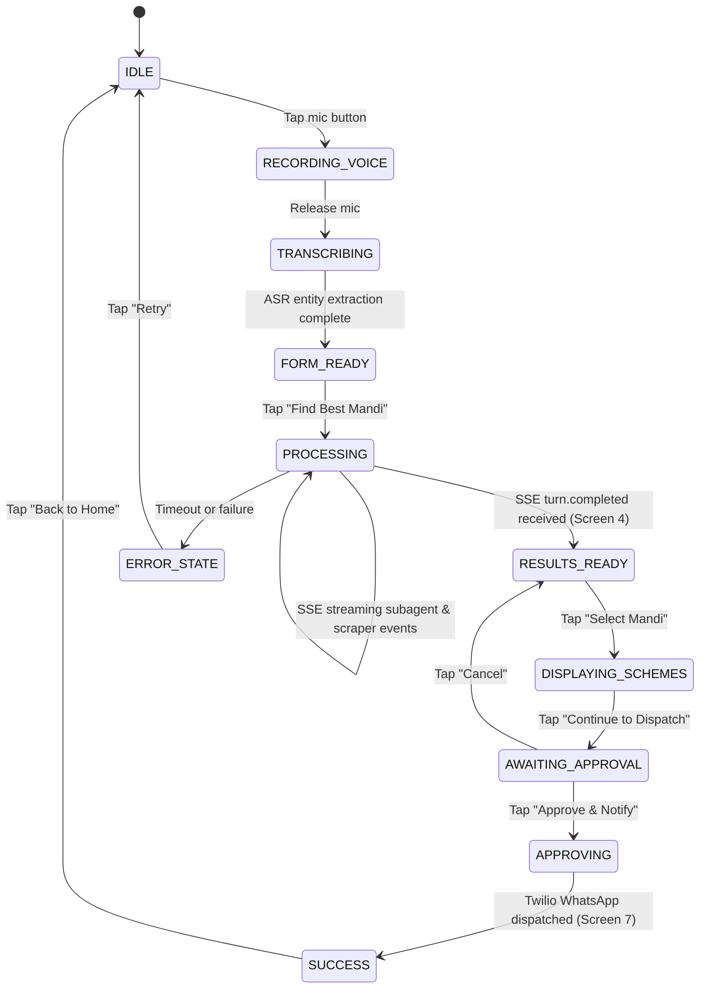

# App Flow & Screens (Flutter Mobile & Web)

This document details the user journey, UI screens, API interactions, and state transitions for the KisanArbitrage Flutter application (supporting both Mobile and Web). The app leverages voice-first interactions and local Indic language support.

---

## UX Model
- **Primary View**: Summary cards (clean, highly scannable, minimal text, green contrast).
- **Secondary View**: Expandable "See Agent Reasoning" accordion showing the live thoughts and data sources of the backend subagents.
- **Interaction Paradigm**: Voice input is the PRIMARY interaction method with manual form fallback.

---

## SSE Event Flow (FastAPI → Flutter)

Flutter connects to `GET /api/v1/sessions/{id}/stream` and receives these real-time events:

| Event | Triggered When | Flutter Action |
|-------|---------------|----------------|
| `subagent.started` | Subagent begins (Market/Logistics/Weather/Scheme) | Pulse subagent indicator amber |
| `subagent.tool_call` | Bright Data scraper or API invoked | Display current scraper status under indicator |
| `subagent.completed` | Subagent finishes data collection | Turn indicator to green checkmark |
| `engine.calculating` | Python math engine starts | Show "Computing net profit with live diesel & ICAR curves..." |
| `turn.paused` | Optimal route identified, awaiting transporter approval | Navigate to Screen 6 (Approval Gate) |
| `turn.completed` | Full analysis done | Navigate to Screen 4 (Comparison Hero Screen) |
| `tool.completed` | Twilio WhatsApp sent | Navigate to Screen 7 (Confirmation & Success) |
| `error` | Any fatal error | Show graceful error screen with retry |

---

## Screen 1: Onboarding / Language Selection
**Purpose**: Choose language and initialize anonymous device ID.

**UI Components**:
- **Language Selection**: 🇮🇳 हिंदी | 🇮🇳 मराठी | 🇬🇧 English.
- **Voice Demo**: "Try saying: मेरे पास 20 क्विंटल टमाटर है" (*I have 20 quintals of tomatoes*).
- **CTA**: "Get Started →" (Stores `device_id` in `shared_preferences`).

---

## Screen 2: Home / New Query
**Purpose**: Gather parameters for the arbitrage calculation.

**UI Components**:
- **Primary Input (Voice)**: Large Floating Action Button with pulsing microphone.
  - *Voice Flow*: Tap mic → Speak in Hindi/Marathi → Bhashini ASR transcribes → Auto-fills commodity, quantity, and origin.
- **Manual Form (Fallback)**:
  - Commodity (Dropdown: Tomato, Onion, Potato, Soybean, Cotton, Wheat, Green Chilli).
  - Quantity & Unit (e.g., 20 Quintals).
  - Origin Location (City / "Use GPS" auto-detect).
  - Vehicle Class (Mini Truck 1-1.5T, Bolero Pickup 2-2.5T, Eicher 14ft 4-6T).
- **Market Pulse Preview**: Daily top moving commodities and arrival trends.
- **Recent Community Reports**: Feed of recent farmer-reported selling prices.
- **Main Action**: "Find Best Mandi" (Triggers `POST /api/v1/sessions/{id}/analyze`).

---

## Screen 3: Processing / Live Agent Swarm
**Purpose**: Visual feedback while scrapers extract data and Python computes arbitrage.

**UI Components**:
- **Scanning Radar Animation**.
- **Subagent Status Timeline**:
  1. 🔍 **Market Intel**: Scraping MSAMB & eNAM prices via Bright Data...
  2. 🚚 **Logistics Intel**: Scraping live diesel rates & calculating route distance...
  3. 🌤️ **Weather Risk**: Querying Open-Meteo route temperatures & rain alerts...
  4. 📜 **Scheme Intel**: Evaluating PM-KISAN & PMFBY eligibility...
- **Expandable Accordion**: "See Agent Reasoning" (monospaced logs).

---

## Screen 4: Profit Comparison (Hero Screen)
**Purpose**: Present ranked mandi options with complete financial transparency.

**UI Components**:
- **TTS Readout Button**: 🔊 "Read aloud" (Plays Bhashini voice summary).
- **Predictive Banner**: 🔮 "Best Time to Sell: SELL TODAY (Heatwave risk along route)".
- **Ranked Mandi Cards**:
  - **Mandi Name & Distance**: e.g., "Pune APMC (230 km)".
  - **Projected Net Profit**: Large green text: `₹38,500` (+₹4,500 vs Local).
  - **Benchmark Badge**: `✅ ₹400 ABOVE TOP BENCHMARK` (or MSP for grains).
  - **7-Day Price Sparkline**: Green/Red trend line.
  - **Market Pulse**: `📦 High Arrivals (High Demand)`.
  - **Community Price Ground Truth**: `👥 Reported: ₹2,050/q (3 hrs ago)`.
  - **Expandable Cost Breakdown**:
    - Gross Revenue: ₹42,000
    - Real Freight (Live Diesel): -₹2,100
    - APMC Cess (1.05%) & Loading: -₹800
    - ICAR Spoilage Loss (38°C transit): -₹600 (3%)
- **CTA**: "Select this Mandi" -> Opens Screen 5 / Screen 6.

---

## Screen 5: Government Schemes Carousel
**Purpose**: Display bonus subsidies and crop insurance.

**UI Components**:
- **Cards**: PM-KISAN, PMFBY (Fasal Bima), eNAM Direct Trade.
- **Eligibility**: "✅ Eligible" with description and enrollment deep-link.
- **CTA**: "Continue to Dispatch →"

---

## Screen 6: Transporter Approval Gate
**Purpose**: Human-in-the-loop checkpoint before external action.

**UI Components**:
- **Summary Comparison Table**: Local Mandi vs Selected Mandi (Net Gain highlight).
- **Logistics Route**: Distance, duration, vehicle type.
- **Warning**: "⚠️ Transporter will be notified via WhatsApp with pickup details."
- **Action**: "✅ Approve & Notify Transporter" -> Sends `POST /api/v1/sessions/{id}/approve`.

---

## Screen 7: Confirmation & Success
**Purpose**: Verified transporter alert.

**UI Components**:
- Confetti & Green Checkmark.
- "Transporter Notified via WhatsApp!"
- Summary: Crop, Quantity, Target Mandi, Estimated Pickup in 2 hours.
- CTA: "Back to Home".

---

## Screen 8 & 9: History & Community Price Feed
**Purpose**: Past transactions and crowdsourced ground-truth price reporting.

**UI Components**:
- List of past queries with realized selling prices.
- "Report Realized Price" bottom sheet to contribute ground truth.
- Filterable community feed by crop and mandi.

---

## State Machine (Client-Side)

