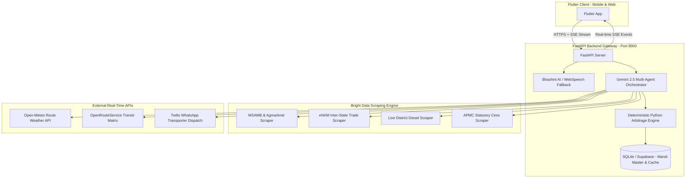
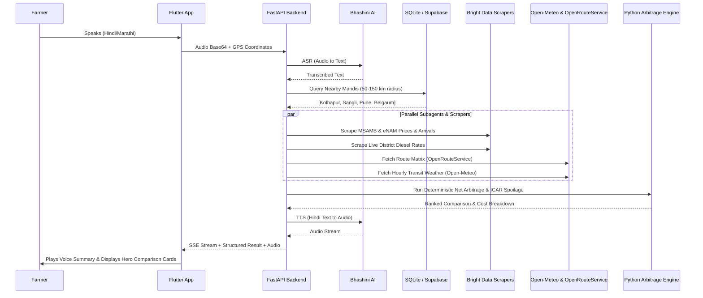
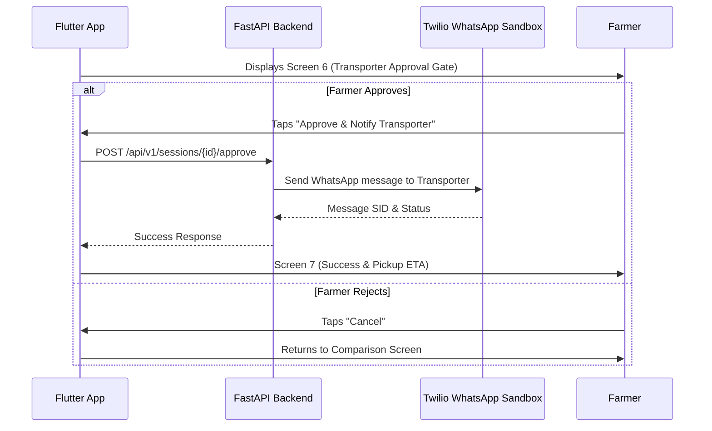

# KisanArbitrage: Architecture Document

## Overview
KisanArbitrage is an autonomous mandi price arbitrage and freight optimization agent for Indian farmers. It calculates the most profitable market for farmers to sell their produce by analyzing real-time prices, transportation costs, tolls, weather risks, and historical trends. The system uses natural language voice interactions to bridge the digital divide.

Built for the **Scrape-Verse Hackathon**, the architecture integrates **Bright Data Web Scraping Infrastructure**, Google Gemini 2.5 Flash, Bhashini AI (Indic language voice/text), deterministic Python math engines, and Flutter Mobile & Web.

---

## High-Level Architecture

The system consists of three cohesive tiers:
1. **Client Tier (Flutter):** Voice-first farmer interface supporting Mobile (Android/iOS) and Web. Employs Riverpod state management and listens to real-time Server-Sent Events (SSE).
2. **Backend Gateway & Intelligence Layer (FastAPI):** Central orchestrator housing:
   - **Gemini 2.5 Multi-Agent Orchestrator:** Intent parsing, parallel task dispatching, and Indic synthesis.
   - **Deterministic Python Calculation Engine:** Sub-millisecond calculation of gross revenue, freight, APMC statutory cess, and ICAR spoilage losses with zero arithmetic hallucination.
   - **Voice Services:** Bhashini ASR/TTS with automatic Web Speech fallback.
   - **Data Stores:** SQLite / Supabase pre-seeded with 50+ APMC mandis.
3. **Data & Scraping Tier (Bright Data & External APIs):**
   - **Bright Data Scraping Engine:** Real-time extraction of MSAMB/Agmarknet daily bulletins, eNAM inter-state trades, and district-level live diesel prices.
   - **External APIs:** Open-Meteo (hourly route weather) and OpenRouteService (distance matrix).

---

## Key Components

### 1. Bhashini Integration (Language Layer)
The backend leverages Bhashini APIs to enable vernacular voice interactions:
- **ASR (Automatic Speech Recognition):** Farmer speaks in Hindi/Marathi/Kannada → Flutter records audio → FastAPI sends to Bhashini ASR → Structured context generated for the agent.
- **Translation:** The Gemini agent reasons in structured English. FastAPI translates the final recommendation into the farmer's preferred language.
- **TTS (Text-to-Speech):** Translated text → Bhashini TTS → Audio stream returned to Flutter for natural voice playback.
- **Browser Fallback:** Web Speech API ensures 100% demo availability even during external API downtime.

### 2. Database & Mandi Discovery
We maintain a pre-seeded `mandi_master` database of 50+ APMC mandis across Maharashtra and Karnataka with exact GPS coordinates and APMC codes.
- **Dynamic Mandi Discovery:** When the farmer provides GPS coordinates, FastAPI queries mandis within a configurable radius (50/100/150 km) and passes candidate markets to the agent.
- **Community Reports:** Farmers can submit realized selling prices via the app. These are stored in `community_reports` and displayed alongside official scraped data.

### 3. Multi-Agent Swarm Orchestrator
The root agent dispatches 4 specialized subagent tasks in parallel:
- **Subagent A (Market Intel):** Uses Bright Data to scrape MSAMB daily auction bulletins, Agmarknet, and eNAM trade data.
- **Subagent B (Logistics Intel):** Scrapes live district diesel prices, calculates vehicle class logistics (Tata Ace, Bolero, Eicher), and queries OpenRouteService for distance and duration.
- **Subagent C (Weather Risk):** Queries Open-Meteo for hourly temperature and precipitation profiles along the route to compute ICAR-CIPHET spoilage risk.
- **Subagent D (Scheme Policy):** Checks farmer profile data against PM-KISAN, PMFBY, and eNAM eligibility criteria.

### 4. Deterministic Python Arbitrage Engine
To guarantee 100% mathematical precision without LLM hallucinations, the collected data is evaluated by native Python modules:
$$\text{Net Profit} = (\text{Quantity} \times \text{Mandi Price}) - \text{Freight Cost} - \text{APMC Cess} - \text{Weighment/Loading} - \text{Spoilage Loss}$$
- **Freight Formula:**
  $$\text{Freight} = \text{Base Hire} + \left(2 \times \text{Distance} \times \frac{\text{Diesel Price}}{\text{Mileage}}\right) + \text{Driver Bata} + \text{Tolls}$$
- **ICAR Spoilage Formula:**
  $$\text{Spoilage Loss} = \text{Gross Value} \times \left(\text{Base Decay Rate} + \Delta T_{\text{excess}} \times k_{\text{temp}} + \text{Rain Factor}\right)$$

---

## Data Flow Diagram

---

## Human Approval Gate & Transporter Dispatch

The approval gate is a critical safety mechanism that prevents automated messages without explicit farmer consent:

---

## Deployment Architecture

The solution uses a 100% free-tier stack optimized for hackathon judging and demonstration:
- **FastAPI Backend:** Deployed on **Railway / Render** (Free tier).
- **Bright Data Scraping:** Powered by Bright Data Hackathon Credits.
- **Mobile & Web Client:** Deployed as a live web dashboard (`flutter build web`) hosted on Vercel / GitHub Pages, and downloadable as an Android APK.
- **Database:** Supabase PostgreSQL and embedded SQLite.

Total infrastructure cost: **$0/month**.
